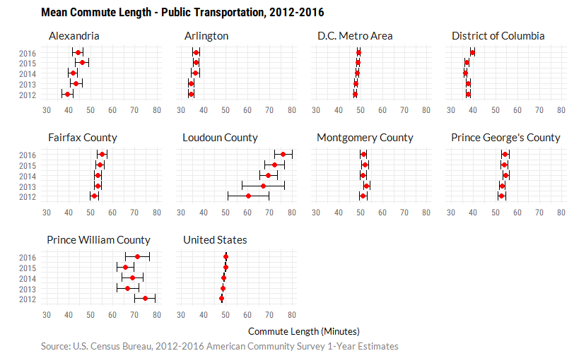
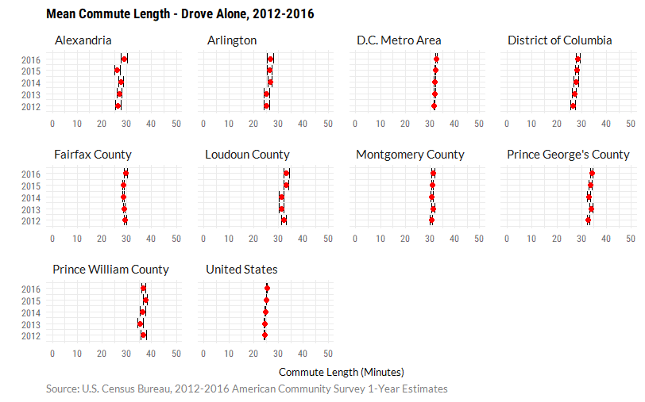

ACS Commute Data: Discussion of Data
================
Simone Roy

Discussion of Margin of Error
-----------------------------

Due to smaller samples, margin of error is larger for American Community Survey 1-Year estimates than for 5-Year estimates. In some cases, the margin of error is so large that it is difficult to determine whether the estimates have changed over time. In these cases, it is difficult to determine whether the data is capturing an emerging trend or if it is merely the result of sampling error.

This often becomes a problem when a jurisdiction meets the minimum population threshold (65,000), but some subpopulations are much smaller. An example of this is shown below: the margin of error is large for the mean commute length of public transportation users in Loudoun County and Prince William County. In 2016, there were 7,051 public transportation users in Loudoun County and 9,476 users in Prince William County, which is much smaller compared to the number of public transportation users in the D.C. metro area (436,979) or in the District (130,451).

In jurisdictions where the subpopulation size was relatively large (for example, the D.C. metro area and the District), it was easier to be confident that the observed changes occurred. In other cases, such as Loudoun County and Prince William County, margin of error is very large, reducing confidence in the estimates. Looking at the estimates alone, it appears that the average commute time for Loudoun County public transportation users has greatly increased. Looking at the margin of error for each estimate shows that this might not be the case.



Margin of error for public transportation commute lengths was generally larger than margin of error among workers who drove alone. In the case of those who drove alone to work, the estimates in Loudoun County and Prince William County have similar error terms to the District of Columbia.



Code used to produced these charts can be found below.

Discussion of Data
------------------

For tables B08007 (Sex of Workers by Place of Work--State and County Level), B08130 (Means of Transportation to Work by Place of Work -- State and County Level), B08301 (Means of Transportation to Work), B08302 (Time Leaving Home to Go to Work), and B08134 (Means of Transportation to Work by Travel Time to Work), the `tidycensus` R package was used to download the ACS data. These tables required little cleaning because `tidycensus` already produces them in a tidy format. An example of this code can be found below for Table B08302. Full code can be found [insert place where I eventually put this file].

Data was cleaned and reshaped using tidyverse packages (`dplyr`, `purrr`, `forcats`). Data was explored and plotted using `ggplot2` and `plotly`. Charts made using `ggplot2` were edited in Adobe Illustrator.

For subject tables (S0801 and S0802), it was more complicated to acquire and clean the data. ACS Subject tables were not supported by the Census API until 2015, so tables were downloaded using the American Fact Finder website and cleaned in Excel. S0801 was used for mean travel time and S0802 for mean travel time by means of transportation. Given the relatively small number of variables, this was easiest to do manually outside of R.

``` r
library(tidyverse)
```

    ## Loading tidyverse: ggplot2
    ## Loading tidyverse: tibble
    ## Loading tidyverse: tidyr
    ## Loading tidyverse: readr
    ## Loading tidyverse: purrr
    ## Loading tidyverse: dplyr

``` r
library(extrafont) #to load fonts

commute_time_by_means <- read.csv("commute_time_by_means_new.csv")

commute_time_by_means %>% filter(Method == "Public Transportation") %>%  #filter for public transportation
  ggplot(aes(x=value, y=Year)) +
  geom_errorbarh(aes(xmin = value - moe, xmax = value + moe)) + #error bar
  geom_point(color = "red", size = 2) + #estimate
  xlim(30, 80) + #set limits so that both charts are scaled similarly
  facet_wrap(~Short_Name, scales = "free_x") + #small multiples by location
  labs(caption = "Source: U.S. Census Bureau, 2012-2016 American Community Survey 1-Year Estimates",
       title = "Mean Commute Length - Public Transportation, 2012-2016",
       x = "Commute Length (Minutes)",
       y = "") +
  theme_minimal() +
  theme(plot.margin = margin(.25, .25, .25, .25, "cm"),
        panel.spacing = unit(.5, "lines"),
        panel.grid = element_line(colour = "grey95"),
        strip.text = element_text(family = "Lato", size=10, hjust=0),
        plot.caption = element_text(hjust=0, family = "Lato", colour="grey50",
                                    margin = margin(t = 5, r=0, b = 0, l =0)),
        plot.title = element_text(family = "Roboto Condensed", size=13, face = "bold"),
        axis.text = element_text(family = "Roboto Condensed", colour="grey40"),
        axis.text.x = element_text(size = 8),
        axis.title = element_text(family = "Lato", size=10),
        axis.title.x = element_text(margin = margin(t = 10, r=0, b = 0, l =0)))
```

``` r
commute_time_by_means %>% filter(Method == "Drove Alone") %>% #filter for drove alone
  ggplot(aes(x=value, y=Year)) +
  geom_errorbarh(aes(xmin = value - moe, xmax = value + moe)) + #error bar
  geom_point(color = "red", size = 2) + #estimate
  xlim(0, 50) + #set limits so that both charts are scaled similarly
  facet_wrap(~Short_Name, scales = "free_x") + #small multiples by location
  labs(caption = "Source: U.S. Census Bureau, 2012-2016 American Community Survey 1-Year Estimates",
       title = "Mean Commute Length - Drove Alone, 2012-2016",
       x = "Commute Length (Minutes)",
       y = "") +
  theme_minimal() +
  theme(plot.margin = margin(.25, .25, .25, .25, "cm"),
        panel.spacing = unit(.5, "lines"),
        panel.grid = element_line(colour = "grey95"),
        strip.text = element_text(family = "Lato", size=10, hjust=0),
        plot.caption = element_text(hjust=0, family = "Lato", colour="grey50",
                                    margin = margin(t = 5, r=0, b = 0, l =0)),
        plot.title = element_text(family = "Roboto Condensed", size=13, face = "bold"),
        axis.text = element_text(family = "Roboto Condensed", colour="grey40"),
        axis.text.x = element_text(size = 8),
        axis.title = element_text(family = "Lato", size=10),
        axis.title.x = element_text(margin = margin(t = 10, r=0, b = 0, l =0)))
```


``` r
#B08302 - Time Leaving for Work
library(tidyverse)
library(tidycensus) #for acs data
library(forcats) #for recoding

census_api_key('xxxxxxxxxxxxxxxxxxxxxxxxxxxxxxxxxxxxxxxx')

#FIPS codes from selected states and counties
dmv_state_fips <- c("11","24", "51")
dmv_counties_fips <- c("11001", "24031", "24033", "51013", "51059", "51107", "51153", "51510")

acs_years <- c("2012", "2013", "2014", "2015", "2016") #select years

b08302_vars <-sprintf("B08302_%03d", seq(2,15)) #select values for variables

#get time leaving for work data for both DC MSA and selected counties within the DC MSA
#DC MSA
time_leaving_for_work_msa <- map_df(acs_years,  function(x) {
  get_acs(geography = "metropolitan statistical area/micropolitan statistical area",
          variables = b08302_vars, summary_var = "B08302_001",
          survey="acs1", endyear = x) %>%  filter(GEOID == "47900") %>%
    mutate(year = x,
           pct = round((estimate/summary_est) * 100, 2))
})


#DC Counties
time_leaving_for_work_dmv <- map_df(acs_years, function(x) {
  get_acs(geography = "county", variables = b08302_vars, summary_var = "B08302_001",
          state = dmv_state_fips, survey="acs1", endyear = x) %>%
    filter(GEOID %in% dmv_counties_fips) %>%
    mutate(year = x,
           pct = round((estimate/summary_est) * 100, 2))
})


#combine data frames for msa and counties
time_leaving_for_work_dmv <- rbind(time_leaving_for_work_msa, time_leaving_for_work_dmv)

B08302_varnames <- read.csv("B08302_varnames.csv") #read in variable labels

#join variable names to the time leaving for work data frame
time_leaving_for_work_df <- right_join(time_leaving_for_work_dmv, B08302_varnames)
```
